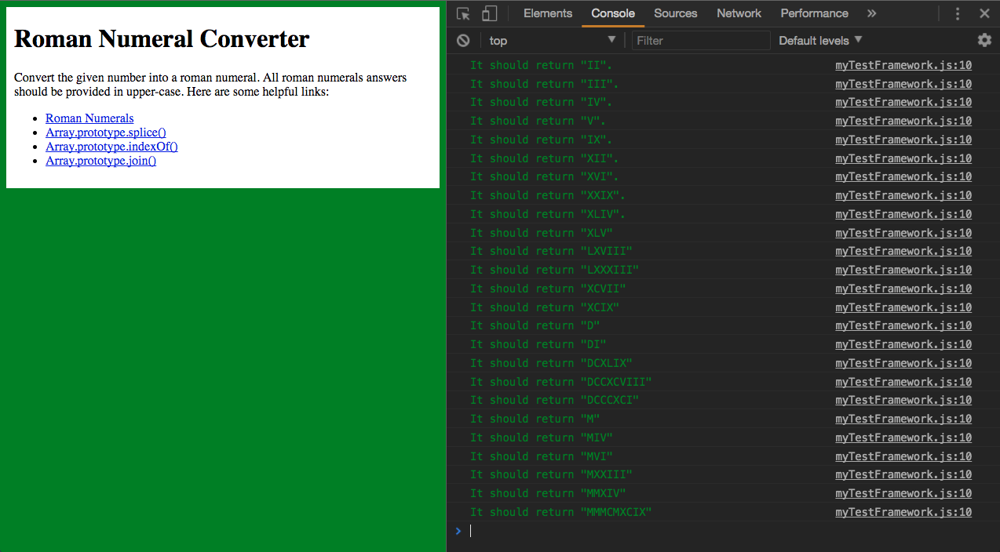
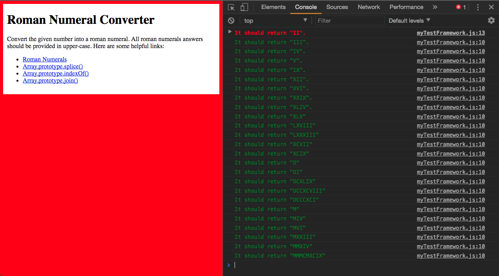
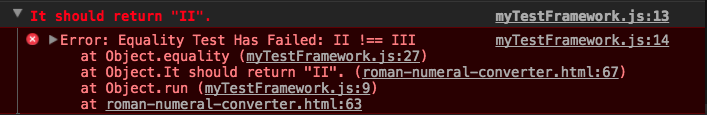

# Simple Test Lib

Based on the [Joe Walnes](https://github.com/joewalnes) [jstinytest](https://github.com/joewalnes/jstinytest), Simple Test Lib it's my personal version of it that I build with the help of the [Watch and Code](https://watchandcode.com/p/premium) Premium Test Driven Development and SimpleTest course series.
I use it primarily to do the [Free Code Camp Algorithm Challenges](https://www.freecodecamp.org) because I just don't like coding on there site.

Example of all the tests passed in the [Roman Numeral Converter](https://www.freecodecamp.org/challenges/roman-numeral-converter) challenge:

Example a fail test:

Detail of fail test:

